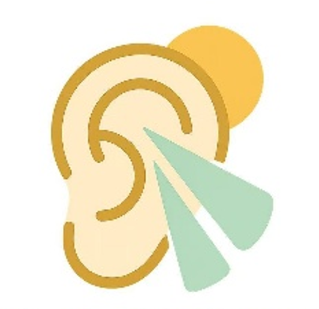

<div align="center">
	
	<h1>耳朵 · EarDo</h1>
	<p>参数化 + 可视化的 AI 声音创作平台（文本 → 调声 → 生成 → 播放/分享）</p>
</div>

---

## 目录
- [目录](#目录)
- [项目概览](#项目概览)
- [产品亮点](#产品亮点)
- [典型用户场景](#典型用户场景)
- [核心功能](#核心功能)
- [系统架构](#系统架构)
- [交互与页面导览](#交互与页面导览)
- [端到端链路](#端到端链路)
- [数据与接口总览](#数据与接口总览)
- [性能与容量预估](#性能与容量预估)
- [部署与环境](#部署与环境)
- [安全与合规](#安全与合规)
- [测试与验收](#测试与验收)
- [路线图](#路线图)
- [常见问题 FAQ](#常见问题-faq)
- [源码索引](#源码索引)

## 项目概览
EarDo 希望把专业声学参数“看得懂、调得动、存得下、传得出”。通过滑条和预设，用户可以在几分钟内完成文本转语音，并感受音高、语速、情感的即时变化，再一键发布或分享。当前版本已跑通核心链路，并具备账号体系、作品流展示与音频直链播放能力。

## 产品亮点
1. **低门槛**：默认参数即刻可用，零学习成本完成首次生成。
2. **所见即所得**：滑条调节即时生效，情感预设帮助非专业用户理解“音色”变化。
3. **闭环完整**：文本 → 生成 → 播放 → 发布/分享，一条链路不中断。
4. **可扩展**：模型、滤镜、存储均做可替换设计，能平滑接入 RVC、DSP、云存储或计费模块。
5. **轻量部署**：默认 SQLite 与云端 TTS，无需本地 GPU，适合演示与小规模试运营。

## 典型用户场景
- **短视频创作者**：快速做差异化配音，提升产出效率。
- **教育讲解**：保持稳定、清晰的讲解音频，便于批量生成课程片段。
- **游戏/二创**：角色感、情绪化语音生成，用于剧情、MOD 或同人作品。
- **入门爱好者**：不懂声学也能通过预设与滑条听出变化，逐步沉淀个人声线。

## 核心功能
- **文本转语音（TTS）**：调用阿里云 CosyVoice v3 flash，生成 MP3。可调语速 rate、音高 pitch、情感 emotion。
- **参数化调声**：`pitch`、`speed`、`emotion` 预设，默认值保证“开箱即听”。
- **播放与分发**：生成音频直接 `<audio>` 播放；作品随帖子发布，支持搜索与详情。
- **账号与会话**：注册/登录/登出、头像、昵称、简介；会话用 HttpOnly Cookie。
- **作品流**：列表、搜索、详情、点赞/评论（接口已备），音频直链 `/api/post/audio/{post_id}`。

## 系统架构
```
浏览器 (Leptos/WASM)
		│  页面渲染 / 参数滑条 / 播放控件
		▼
Server Functions (Axum + Leptos)
		│  鉴权 / 元数据 / 生成调度 / 帖子
		▼
CosyVoice TTS (云服务)
		│  WebSocket 流式返回 MP3
		▼
SQLite (用户 / 会话 / 声线 / 帖子 / 音频)
```
- 前端：Leptos 路由与组件，SSR 首屏 + CSR Hydration，样式走 Tailwind 风格。
- 后端：Axum 路由 + Leptos Server Functions，统一注入数据库与 Provider。
- 存储：SQLite 默认零依赖，后续可迁移 MySQL/PostgreSQL；音频/头像可改存对象存储。

## 交互与页面导览
- **欢迎页**：品牌展示与引导 CTA，默认入口。
- **首页 /home**：主要调声与生成入口，文本输入 + 参数滑条 + 生成按钮。
- **声音广场 /voice**：浏览作品卡片，播放、查看描述与互动计数。
- **声音滤镜 /filters**：预设声线/滤镜列表（数据结构已备，后端可扩展）。
- **帮助 /help**：操作指引与常见问题。
- **登录/注册 /login /register**：账号体系入口，未登录时 Header 显示“登录”。
- **个人资料 /profile**：头像、昵称、简介；支持 base64 头像上传。

## 端到端链路
1. **输入阶段**：用户输入文本，调整 `pitch/speed/emotion`（默认值保证即用）。
2. **生成阶段**：`generate_audio` Server Function 解析元数据 → 通过 WebSocket 调用 CosyVoice → 流式累积 MP3。
3. **存储阶段**：音频可存入数据库或作为帖子内容的一部分；接口 `/api/audio/{id}`、`/api/post/audio/{post_id}` 暴露流式播放。
4. **分发阶段**：作品流展示作者、时间、描述、点赞/评论计数和音频链接；支持搜索与详情。

## 数据与接口总览
- **数据模型（摘要）**
	- `VoiceParams`：`pitch`/`speed`/`emotion`（见 [app/src/data.rs](app/src/data.rs)）。
	- `VoiceMetaInfo`：声线/滤镜元数据，含 `base_model_id`、`pitch`、`speed`、`volume`、`emotion` 等。
	- `VoiceModelInfo`：基础声线模型信息（名称、分类、描述）。
	- `PostInfo`：帖子/作品，metadata 内含作者、时间、描述、点赞/评论计数、音频链接。
	- `UserInfo`：用户资料（头像、昵称、简介、状态）。
- **接口分组（Server Functions）**
	- 认证：`register`、`login`、`logout`、`get_current_user`。
	- 用户：`get_user_profile`、`update_user_profile`（支持 base64 头像）。
	- 声线与元数据：`list_voice_models`、`get_voice_model`、`update_voice_model`、`delete_voice_model`；`list_voice_metadata`、`get_voice_metadata`、`update_voice_metadata`、`delete_voice_metadata`、`generate_audio`。
	- 帖子：`list_posts`、`search_post`、`get_post`、`create_post`、`update_post`、`delete_post`、`comment_on_post`、`like_dislike_post`。
	- 媒体流：`/api/audio/{id}`、`/api/avatar/{user_id}`、`/api/post/audio/{post_id}`。

## 性能与容量预估
- **推理延迟**：CosyVoice v3 flash 典型 1–3 秒（视网络与文本长度而定）。
- **并发**：默认 SQLite 适合小规模；并发上升时可迁移 MySQL/PostgreSQL，并增加连接池上限与缓存。
- **带宽**：MP3 输出，码率较小；前端直接流式播放，减少下载等待。
- **缓存策略（可选）**：可对重复文本+参数做缓存或预生成，当前版本未开启以保持简单。

## 部署与环境
- **依赖**：Rust 稳定版、`cargo`；端到端测试需 Node 与 Playwright。
- **关键环境变量**：`ALIYUN_API_KEY`（CosyVoice 调用必须）。
- **本地快速启动**：
	1. 安装依赖：`cargo fetch`
	2. 运行后端：`cargo run -p server`
	3. 访问：`http://127.0.0.1:3000`
	4. （可选）前端 Watch：`cargo leptos watch`
	5. 端到端测试：`cd end2end && npm install && npx playwright test`
- **迁移建议**：
	- 数据库：从 SQLite 迁移到 MySQL/PostgreSQL 以支撑并发与持久化；
	- 对象存储：头像/音频迁移至 OSS/S3，减轻 DB 压力；
	- 缓存：加入 Redis 做 session/生成结果缓存。

## 安全与合规
- **会话**：`session_token` 写入 HttpOnly + SameSite=Lax Cookie，30 天有效；存储在 `user_sessions` 表。
- **权限与状态**：用户/声线/帖子具备状态字段（normal/hidden/official/banned 等），支持软删除与官方标记。
- **隐私与版权**：当前只采集账号基础信息与头像；建议上线时增加音频水印、用户声明与内容合规检测。
- **错误处理**：缺少 `ALIYUN_API_KEY`、任务失败、未登录等都会返回清晰错误，前端可提示用户。

## 测试与验收
- **单元/集成**：Rust 层可用 `cargo test`（未在此仓库预置测试样例）。
- **端到端**：`end2end` 目录提供 Playwright 脚手架，可覆盖登录、生成、播放、发帖主链路。
- **手动验收清单**：
	- 登录/注册：输入合法凭据后成功创建会话；登出清除 Cookie。
	- 生成：填写文本，调节参数后成功生成并播放音频。
	- 帖子：创建帖子可上传音频（或使用生成结果），列表与详情可见，音频可播。
	- 头像：上传 base64 头像后 `/api/avatar/{user_id}` 正常返回。

## 路线图
- **近期**：
	- 补足前端错误提示与生成进度；
	- 加入缓存与并发限流；
	- 上线声线库与基础 DSP 滤镜；
	- 完善移动端样式与可访问性。
- **中期**：
	- 接入 RVC 变声与更多官方声线预设；
	- 作品分享卡片、榜单、评论/点赞全量上线；
	- 对象存储/缓存层替换，支持更大流量。
- **远期**：
	- 商业化（订阅/按量计费/声线市场分成）；
	- 国际化与多语言支持；
	- 多模型编排、移动端/边缘推理。

## 常见问题 FAQ
- **需要 GPU 吗？** 现阶段不需要，TTS 走云端 CosyVoice。
- **为什么生成失败？** 常见原因：未配置 `ALIYUN_API_KEY`、网络不可达、输入文本过长或空白。
- **音频在哪存？** 默认存 SQLite 的 BLOB，可按需切换到对象存储。
- **能否自带声线？** 当前支持通过元数据指定 `base_model_id`，后续将上线声线库与上传入口。
- **并发会不会顶不住？** 小规模 OK，若上量需切换数据库、增加缓存与限流。

## 源码索引
- 前端壳与路由：[app/src/lib.rs](app/src/lib.rs)、[app/src/pages.rs](app/src/pages.rs)
- 数据与接口定义：[app/src/api.rs](app/src/api.rs)、[app/src/data.rs](app/src/data.rs)
- 服务端入口与注入：[server/src/main.rs](server/src/main.rs)
- 生成与元数据：[app/src/api/voicedata.rs](app/src/api/voicedata.rs)、[app/src/api/voice_backend_api.rs](app/src/api/voice_backend_api.rs)
- 帖子与作品流：[app/src/api/post.rs](app/src/api/post.rs)
